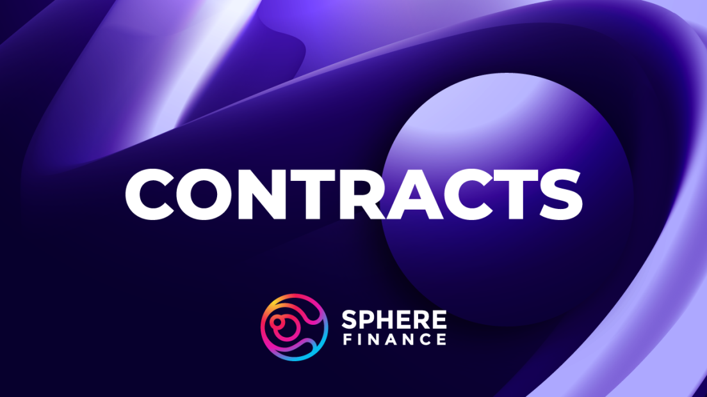

# Contracts

Contracts & Treasury Addresses

SPHERE:
[0x62f594339830b90ae4c084ae7d223ffafd9658a7](https://polygonscan.com/address/0x62F594339830b90AE4C084aE7D223fFAFd9658A7)

ylSPHERE: 
[0x4Af613f297ab00361D516454E5E46bc895889653​](https://polygonscan.com/token/0x4Af613f297ab00361D516454E5E46bc895889653)

Investment Treasury:
[0x20D61737f972EEcB0aF5f0a85ab358Cd083Dd56a](https://debank.com/profile/0x20d61737f972eecb0af5f0a85ab358cd083dd56a)

​
Liquidity Pool Treasury:
[0x1a2ce410a034424b784d4b228f167a061b94cff4](https://debank.com/profile/0x1a2ce410a034424b784d4b228f167a061b94cff4)

​
RFV Treasury:
[0x826b8d2d523e7af40888754e3de64348c00b99f4](https://debank.com/profile/0x826b8d2d523e7af40888754e3de64348c00b99f4)

Sphere Finance Charity Wallet:
[0x74b514BC1B9480E1DacA0F83A1e42B86291eaDEF](https://debank.com/profile/0x74b514bc1b9480e1daca0f83a1e42b86291eadef)

Sphere Finance Binance Safe 1:
[0x124E8498a25EB6407c616188632D40d80F8e50b0](https://debank.com/profile/0x124e8498a25eb6407c616188632d40d80f8e50b0)

Sphere Finance Binance Safe 2:
[0x79e51953F023dF68FC46170d1EE47FD5a49D3B6e](https://debank.com/profile/0x79e51953F023dF68FC46170d1EE47FD5a49D3B6e)

Sphere Finance Arbitrum Safe:
[0xA6efac6a6715CcCE780f8D9E7ea174C4d85dbE02](https://debank.com/profile/0xa6efac6a6715ccce780f8d9e7ea174c4d85dbe02)

Sphere Finance Optimism Safe:
[0x93B0a33911de79b897eb0439f223935aF5a60c24](https://debank.com/profile/0x93b0a33911de79b897eb0439f223935af5a60c24)

Sphere Finance Base Safe 1:
[0xE799961B76d65A32365D34289D5AeA6C2242FC98](https://debank.com/profile/0xE799961B76d65A32365D34289D5AeA6C2242FC98)

Sphere Finance Base Safe 2:
[0x6268a34936dC06A3a8D8b9caEe25432913330270](https://debank.com/profile/0x6268a34936dC06A3a8D8b9caEe25432913330270)

Sphere Finance Mantle Safe:
[0xfDC0366b5A0dFe9FE1fb588897aD1705FDb375b0](https://debank.com/profile/0xfDC0366b5A0dFe9FE1fb588897aD1705FDb375b0)

Balancer LP:
[0xf3312968c7d768c19107731100ece7d4780b47b2](https://balancer.fi/pools/polygon/v2/0xf3312968c7d768c19107731100ece7d4780b47b2000200000000000000000a50)