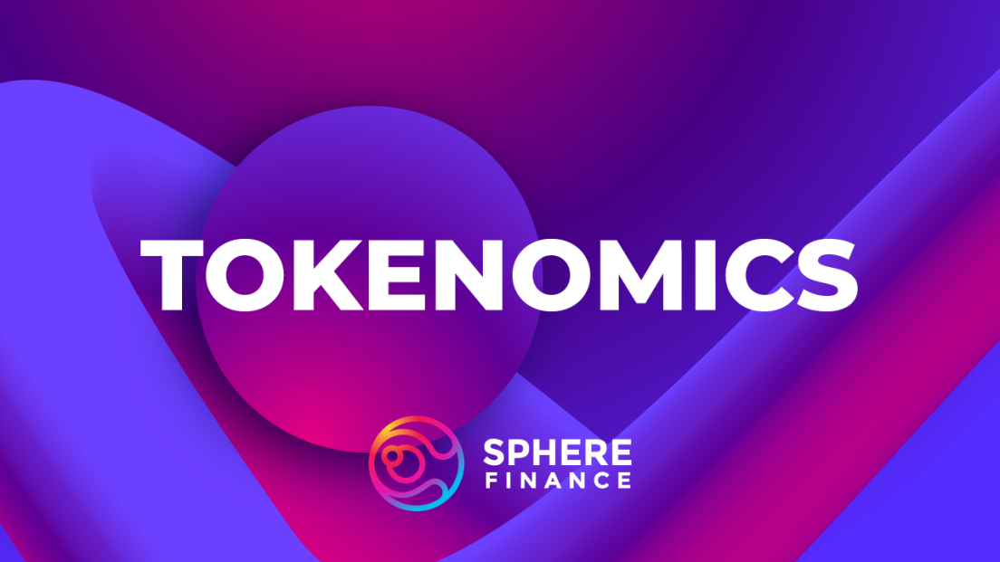

# $SPHERE

### The governance token of Sphere's ecosystem

$SPHERE is Sphere Finance’s governance token. The $SPHERE token has a fixed supply and is currently deflationary in nature.

The $ylSPHERE (yield-locked $SPHERE) vault on [Dyson](https://dyson.money/) allows for $SPHERE holders to stake their tokens and earn real yield.

This yield is currently distributed in real yield as $wPOL. Yield may be distributed in other token types in the future.

