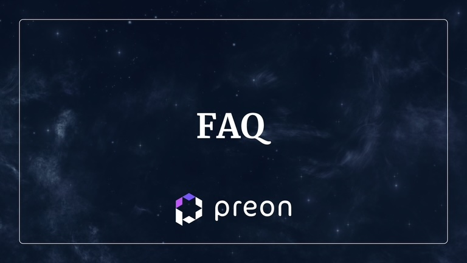

# FAQ

# What are the key benefits of Preon?

Preon offers several key benefits to its users. It is a zero-percent-interest CDP (Collateralized Debt Position) protocol within the Sphere Ecosystem. This means you can open a collateralized debt position, and deposit a wide variety of tokens without incurring any interest.
Additionally, Preon offers yield farming capabilities for $STAR while your collateral is also made yield-bearing through farming with low-risk strategies, which optimizes your yield returns. This makes Preon an attractive and secure environment for both new and experienced DeFi users.

# Is using Preon safe?

Preon prioritizes user safety and the security of the platform. The codebase has undergone audits by multiple reputable parties including Dedaub, Peckshield, and Nethermind, titans in blockchain security. These audits ensure a robust and secure protocol for our users to the best of our abilities.
To ensure further safety, Preon also employs a multisig system consisting of 8 participants, which adds an extra layer of security.
Furthermore, Preon's smart contracts are upgradeable, allowing for continuous improvement in security and functionalities. Worth noting is the fact that they are under a 7-day time lock period and a multisig requiring a majority of approvals.

# How can I use Preon?

Preon provides multiple functionalities for a variety of users. Users can open a collateralized debt position to borrow the $STAR stablecoin, depositing various tokens as collateral.
The protocol also supports yield farming through the Stability Pool, allowing users to earn yield with $STAR. Preon allows users to leverage numerous varied collateral types, giving a significant amount of versatility when accessing the protocol’s solutions.
Additionally, $STAR Stability Pool providers can participate in yield farming activities, and $PREON token holders can lock their tokens into the protocol’s veNFT contract, which gives them $vePREON.

# Are there any fees or negative APYs for using Preon?

Preon charges minimal fees for maintenance and upkeep of the protocol, and to provide yield for $vePREON holders.
Preon does not charge interest on debt. There is a small borrow fee of up to 8% paid over 6 months, as well as an upfront redemption fee of 0.5%.
Additionally, a performance fee is taken on any farming done via a Nebula Vault, which is distributed to $vePREON lockers.

# What are OFTs?

OFTs, or Omnichain Fungible Tokens, are tokens that are interoperable across multiple chains, facilitated by LayerZero technology. This integration with LayerZero makes both $PREON and $STAR OFTs, enhancing flexibility and utility across different chains.

# What is a Stability Pool?

The Stability Pool is a mechanism that $STAR users can utilize to earn liquidation fees. Stability Pools are essential for CDPs, ensuring that the supply of $STAR is always collateralized.
Preon’s Stability Pool is instrumental in maintaining the stability of the $STAR stablecoin peg. It ensures that one $STAR token is always backed by more than $1 in collateral via over-collateralization.
Since blue-chip assets are so volatile and experience significant fluctuations in price on a regular basis, one way that Preon protects the over-collateralization of $STAR (and thus its peg) is through the Stability Pool, which acts as the first line of defense for the $STAR peg.
To incentivize users to deposit $STAR into the Stability Pool, SP providers receive emissions in $oPREON, which they can later redeem for $STAR or $PREON, or zap into $vePREON.

# What are Nebula Vaults?

Nebula Vaults are smart contract vaults that act as collateral in exchange for the ability to borrow $STAR. These vaults are the backing of the stablecoin and are used mainly to optimize the farming opportunities for all users in different ways.

# Is there a maximum number of vaults one can open?

You can open one vault per collateral type.

# Is there a permanent Auto-Lock feature for $vePREON?

Not at the moment.

# What are the steps to provide liquidity for $STAR?

To provide liquidity for the $STAR token, you can either:
Mint $STAR on the Preon dashboard or swap for $STAR on any DEX that has it listed.
Provide liquidity on any DEX that you wish.
Through Preon’s integration with Dyson, users can deposit $STAR LPs into Dyson’s vaults to earn auto-compounded yield.

# Can the developers do something if I get liquidated?

No, developers cannot intervene in liquidation events due to the decentralized nature of Preon. Liquidations are necessary components of the protocol to ensure its stability and security. It's important for users to manage their positions responsibly to avoid liquidation.
Users are encouraged to monitor their LTV ratio as it compares to the specific vault’s max LTV in order to manage their position, and adjust accordingly.

# What kind of power do the developers have over the protocol at a smart contract level?

The developers, or the Preon Core, reserve the right to upgrade contracts. All actions are performed with a time lock of 7 days and require a multisig approval from 4 out of 7 participants. This ensures the security and transparency of the protocol. In the future, the Core plans to delegate governance matters to the Preon DAO, allowing for more decentralized control over the protocol.

# How do I Liquidate vaults?

To perform liquidations you will need to use the Vessel Manager Operations contract:
| Network                | Address     |
| ---------------------- | ----------------------
| Polygon   | 0x7a004e02177da08df4e4eec15a0f75fb5de6af04 |
| Arbitrum  | 0x7a004e02177da08df4e4eec15a0f75fb5de6af04 |
                    
Vessel Manager Operations Contract > write > liquidateVessels

- asset > collateral you wish to liquidate
- n > amount of vaults you wish to liquidate in one transaction (generally advised 10)

Liquidations can occur on other chains as well, as soon as collateral types are added on the respective chains.

## Collaterals

Polygon

| Token  | Address   |   
|---|---|
| wMATIC   | 0x0d500B1d8E8eF31E21C99d1Db9A6444d3ADf1270  |   
| stMATIC   |0x3A58a54C066FdC0f2D55FC9C89F0415C92eBf3C4  |   
| wMATIC/wETH |0xAf02d0BE61C17900061C4AAbB9d263A68B5d3C87 |   
| MATICx/wMATIC |  0x8ec4913A83dDBE2eBfa79A92D8fa28f500EA0061 |

Arbitrum

| Token  | Address   |   
|---|---|
| wETH  | 0x82aF49447D8a07e3bd95BD0d56f35241523fBab1  |   
| wstETH | 0x5979D7b546E38E414F7E9822514be443A4800529 |
