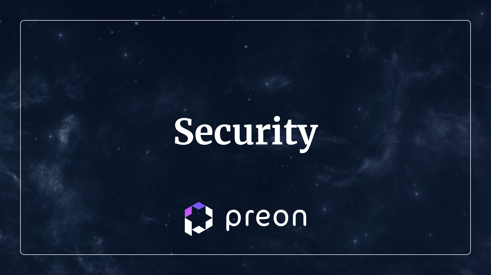

# Security

Smart Contract security is a priority for Preon. All precautions are and will be taken to ensure the protocol is safe to use.

All collateral types are peer-reviewed & tested to ensure they are safe to use.

## Audits

[Audit 1 - Dedaub (June 2023)](https://drive.google.com/file/d/15PDD8G1RHLIMeSGDDEAF8Eh1Qjw2CEXo/view)
[Audit 2 - Peckshield (May 2024)](https://drive.google.com/file/d/1vjAsAaG_pjIrWZaQiJLkSEmupFsFovsU/view)

## Codebase

**$wETH, $wMATIC, $stMATIC & $wstETH Nebula Vault**

Nebula Vaults use [Dyson](https://docs.dyson.money/contracts-and-security/contracts) for their yield farming. Includes auditing and battle-tested code.

## Contact

If you have any feedback or concerns, please reach out to us on Discord by creating a ticket.
