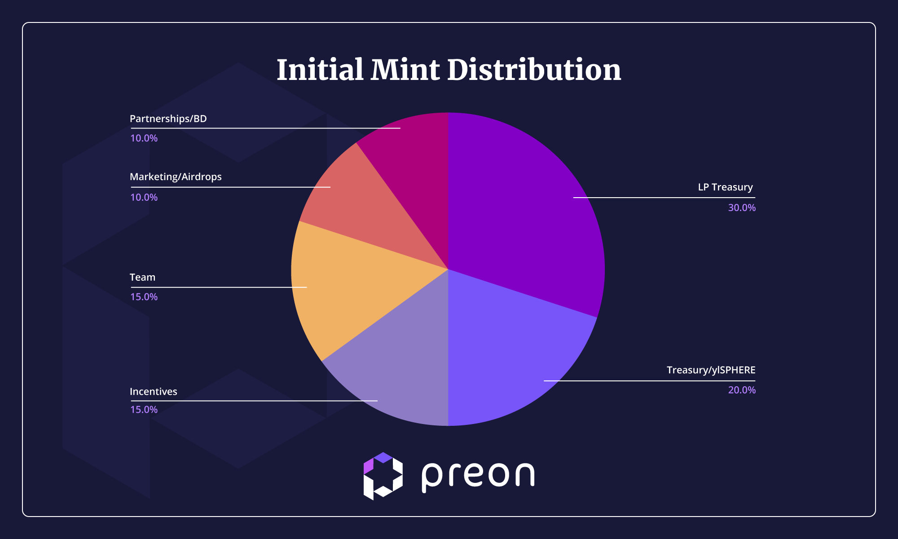

# Tokens

Definitions & Concepts

# $PREON — ERC-20 native OFT utility token

$PREON is the protocol’s main utility token powered by LayerZero, giving users the ability to engage in secondary market activity, provide liquidity, and lock into $vePREON through the protocol’s veNFT contract.

$PREON’s initial mint supply: 500,000,000

$PREON has an elastic supply due to being an emissions token.

$PREON epochs will start minting at 2% of initial supply or 10,000,000 $PREON 

The decay rate of emissions is set at 1%.

It is important to note that the Stability Pool will not receive all emitted tokens per epoch. 

The amount of tokens distributed to depositors is determined by TVL thresholds set by the team. These tokens are allotted to the Stability Pool. 

This is done to ensure fair and continuously incentivised growth and stability into the future and to avoid the funneling of rewards early on.  

The amount and length of participation should reward more than the timing of participation.  

Any unused emissions will be forwarded to a time of greater TVL and not used anywhere else.

***The TVL thresholds will remain internal to negate gamification***.

LP Treasury ($PREON): This allocation is unlocked, and will be used for the creation of $PREON liquidity pools across multiple chains.

Treasury/ylSphere ($vePREON): This allocation was given to the Sphere treasury in the form of a veNFT and will remain locked. The veNFT will start as blacklisted and gradually become whitelisted to curb early dilution. 

Incentives ($PREON): This allocation will be used for incentives, and will be unlocked for potential incentivization campaigns.

Team ($vePREON): A veNFT is given to the team. This will begin as blacklisted and gradually become whitelisted at a slower rate than others. It will be held by the Treasury to maintain governance.

Marketing/Airdrops ($vePREON): This allocation will be used in marketing campaigns including a small portion for the Starlord airdrop. It will be blacklisted until used for marketing.

Partnerships & BD ($vePREON): Will be used for partnerships and is blacklisted until it is needed.

Blacklisted means that these veNFTs initially do not receive any yield from the protocol. 

| Allocation           | veNFT # | Wallet Address                              | 
|----------------------|---------|---------------------------------------------|
| Treasury/ylSPHERE    | 20      | 0xE799961B76d65A32365D34289D5AeA6C2242FC98  |   
| Team                 | 19      | 0xE799961B76d65A32365D34289D5AeA6C2242FC98  |   
| Marketing/Airdrops   | 18      | 0xE799961B76d65A32365D34289D5AeA6C2242FC98  |   
| Partnerships & BD    | 17      | 0xE799961B76d65A32365D34289D5AeA6C2242FC98  |

# $vePREON — ERC-721 governance token in the form of an NFT

$vePREON is the vote-escrowed version of $PREON. Users can lock their $PREON tokens for up to 2 years to receive $vePREON.

$vePREON holders participate in protocol revenue sharing from various streams.

To encourage continuous locking and sustained participation from stakeholders, the $vePREON balance of users decays over time until it reaches zero at the conclusion of the initial locking period. $vePREON positions can be merged, extended, and transferred.
