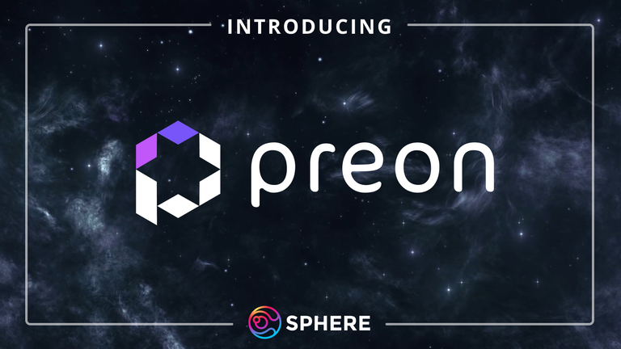

# Preon

### 0% interest omnichain CDP protocol

While lending & borrowing are integral to DeFi, there are still risks when collateralizing your assets. Please exercise your own due diligence and research, and deposit accordingly.

The following section of the documentation covers the Sphere ecosystem, exclusively pertaining to its utility to $SPHERE as a token. To dive deeper into Preon, join the Preon Finance Discord [server](https://discord.com/invite/preon) & follow Preon on [𝕏](https://x.com/PreonFinance).

Preon is a 0% interest omnichain CDP protocol. Using Preon, users can collateralize assets to leverage their yield farming experience and access unique farming opportunities, or simply use their assets without the need to sell them.

## Why borrow on Preon?

Preon is a CDP protocol. This means that there is no money market dependent on lenders depositing stablecoins. Instead, Preon issues its own stablecoin, $STAR, which makes borrowing on Preon much more accessible.

This allows users to collateralize their loans with a variety of tokens, from bluechip assets, and other assets that will be supported in the future. 

The Sphere Finance Treasury will be receiving an allocation of $vePREON.  Through this veNFT, a portion of Preon’s performance fees will be directed to the Sphere Earnings Pool, and thus to $ylSPHERE lockers. To learn more about the treasury’s veNFT allocation, click [here](https://docs.preon.finance/docs/Preon%20Tokenomics/Tokens).
