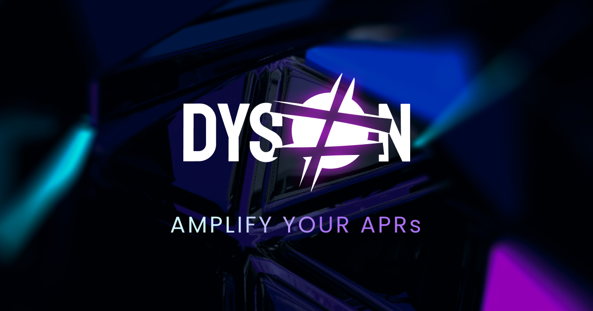
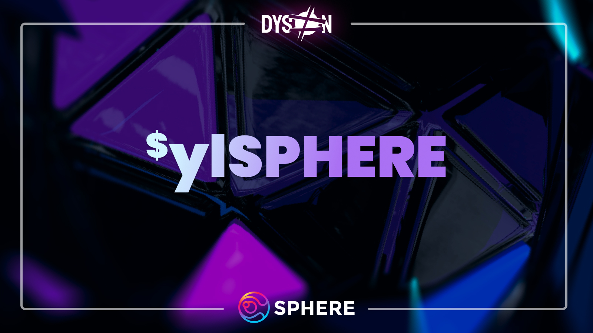

# Dyson

## Bringing steady growth to your portfolio

The following section of the documentation covers the Sphere ecosystem, exclusively pertaining to its utility to $SPHERE as a token. To dive deeper into Dyson, click [here](https://dyson.money/).

Dyson is a decentralized multichain yield maximizer and ALM (Automated Liquidity Manager). Dyson maximizes yield through carefully crafted strategies managed on-chain, making perpetual yield farming accessible to the average user.

The connection between Dyson and Sphere is the Sphere Earnings Pool.

The Sphere Earnings Pool is a single-sided Dyson vault in which holders of Sphere’s governance token, $SPHERE, can lock their tokens in order to start earning real yield on their tokens. This real yield distributed to $ylSPHERE lockers is earned from the performance fees generated by the Sphere ecosystem.

The pool's yield is currently exclusively distributed in $wPOL. Due to its real yield, the returns are variable.

How frequent are rewards?

Rewards are distributed on a 7-day cycle. At the end of each cycle, the vault will **temporarily** stop distributing rewards until it is refilled. At that time, the multisig team will promptly refill the vault and initiate a new 7-day cycle. Due to the current vault structure, it cannot be pre-filled, but this process will be enhanced with an upcoming tokenomics upgrade to improve the overall flow and increase decentralization.
