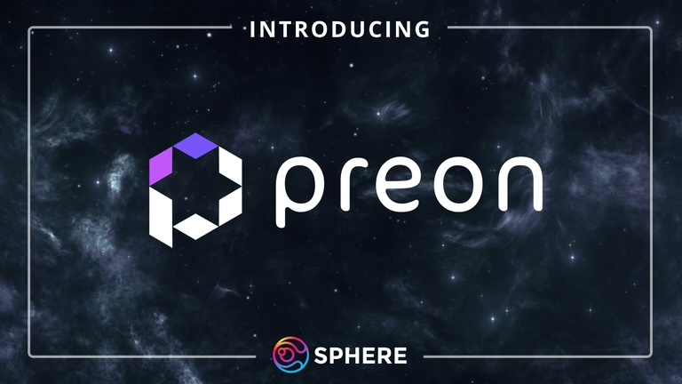

# Introduction

0-interest lending & borrowing at your fingertips.

# What is Preon?

​
[Preon](https://www.preon.finance/) is a decentralized CDP (or Collateralized Debt Position) protocol that allows you to borrow against your crypto - at 0% interest. Loans are paid out in $STAR (our USD-pegged stablecoin) with a minimum maintained collateral ratio of 110%.

Preon accepts multiple token types as collateral, making $STAR available to a wide range of users. This makes Preon one of the few CDP protocols that charge no interest for leverage-farming.

$STAR can be redeemed for $1 of underlying collateral, minus protocol fees.

For more information - [join our Discord](https://discord.com/invite/preon)!

# What makes Preon special?

Preon is built with unique strategies that amplify popular CDP models & mixes it with mechanisms which build liquidity. Some of these mechanisms include:

- OFT integration with LayerZero
- Option calls as reward emissions
- Nebula Vaults
- Incentivized Stability Pool
- Unique collateral types

Each mechanism is supported by an ecosystem of partners who utilize the protocol & an extremely robust code-base allowing for decentralization of the protocol.
